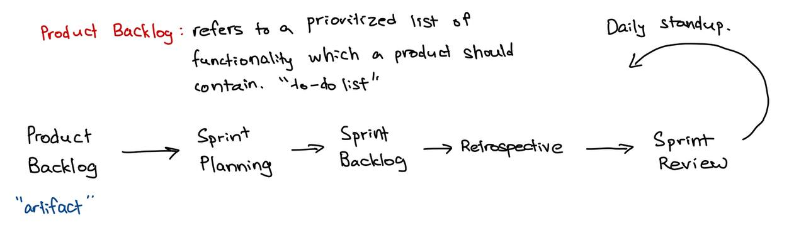

# Scrum Methodology

## Scrum Overview

- Lightweight framework designed to solve complex problems that required sprinting or iterating through a solution.
- Inspection, Adaption and Transparency.
- Sprint (anywhere from 1-4 weeks)
  - get it production-ready by the end of the sprint for customer.
  - Planning, developing, testing and reviewing of a working unit of software is completed with this time box.
- Scrum is an Agile way of developing software of any project.
- Scrum is more of a framework than a methodology or process.
- Scrum recommends a self-organizing and cross-functional team.
- If there is a challenge or a conflict in the team, they come together and discuss and decide on a own way to move forward as a team.

## Scrum values

- Openness
    - Open to living the scrum values over just doing scrum.
    - Team members are open to unconvering better ways of developing software and solving problems.
- Commitment
    - General understanding of commitment in this context is to commit to the sprint goal. However, there is more to that.
    - Team commits to working as a team and doing their best to bring value to the customer.
    - Team commits to give their best action & effort versus the results at the end of the Sprint.
- Focus
    - Focus on the sprint's worth of work.
    - Focus on removing solving problems and removing impediments.
    - Focus on bringing value to customers.
- Courage
    - Team members show up with courage when working in tough problems.
    - Team members show up with courage while dealing with constant change and adapting.
- Respect
    - Respect each other in the team and be professional.
    - Respect and embrace the differences (different opinions, ways of working, solving problems culture and background).

## Concept of Sprints

- Timebox period to deliver potentially shippable work.
- 1-4 weeks
- Team member plans the work with the product owner and scrum master.
- Deliver product increment at the end of the sprint
- Sprint planning, daily standup, sprint review, restrospective.

## Scrum Roles Overview

- Product Owner
    - Talk to the stakeholders and users to understand their needs and vision of the product.
    - Come back to the team and help the team understand the product vision.
    - Also give the team some description of the product feature and what needs to be built.

- Product Owner writes a simple description of the product feature from an **end user's perspective** (called **user stories**) & prioritizes these work items (or user stories).
    - `As a <End User Role>, I want to <desired action> so that <desired benefit>`.

- Scrum Master
    - Ensures Scrum is understood and used skillfully by Scrum Team.
    - Servant Leader
    - Models Agile Mindset and Scrum Framework.

- The development team
    - Build product increment
        - In scrum, a product increment is whatever you previously built, plus anything new you just finished in the latest sprint, all integrated, tested, and ready to be delivered or deployed.
    - Dev Team is cross functional
        - has the skillset to deliver that product feature.
    - Self-organizing
        - don't need manager to organize their work.
        - collaborate with product owner on their roles.
    - 3 to 9 people.

- The development team is a group of professionals who are capable of delivering a potentially releasable increment at the end of the sprint.

- Role of a Scrum Master
    - Daily standup (what you did yesterday, what are you going to do today, and any impediments?)
    - Are we in track to meet our sprint goal?
    - Sprint planning, retrospective, sprint review
    - retrospective
        - what went well? what didn't go well? what can we improve?

- Role of a Product Owner
    - Translate business to user stories for the team to work on.
    - Explaining the functionality that is needed to the team.
    - **Minimum Viable Product (MVP)**: lowest thing that could be delivered to create some value.
    - have a good vision of the product line
    - Update the Product Backlog and ensure the user stories are refined.

- Role of the development team
    - help each other to get the things done.

