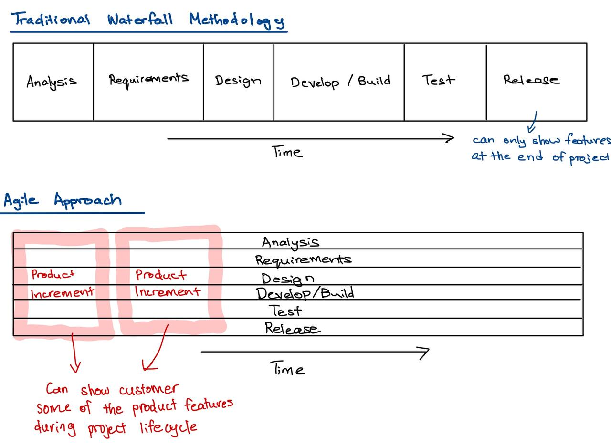

# Scrum Methodology: Scrum Terms and Artifacts

## User Stories

- Simple description of a product feature that is written from an end user's point of view.
    - Who is the user?
    - What is the customer's goal?
    - What value can we bring?
- User Story Format
    - As a (user or type of user), I want to (some goal or what) so that (I can achieve some value or why).
- User Stories are great invitations for conversations (not documentation).
- The 3 C's
    - Card (brought to the team)
    - Conversation 
    - Confirmation (development team confirms with the idea in Product Owner's mind)

## User Stories - Acceptance Criteria

- Acceptance Criteria are simple notes or conditions added to the user story, that tells what the user story must do to satisfy the needs of the customer - defined by the Product Owner.
- Shows up in the Confirmation face (team member collaborate with Produt Owner)
- Acceptance Criteria enriches the user story by making it testable and ensures the story is ready for demo.
- Product Owner writes the initial Acceptance Criteria and brings them to discuss with the team.
    - Team comes to a confirmation with Product Owner on what should be included in the User Story.
- Acceptance Criteria (AC) covers these 3 important things: 
    1. AC should be testable with pass/fail results.
    2. AC should be clear and concise
    3. AC should be created with shared understanding between the team and Product Owner.
- How many Acceptance Criteria per user story?
    - Recommend 3-7 per user story.

#### Acceptance Criteria Example

- User Story: "As a new student, I want to be able to create an account, so that I can enroll into a course".
    1. User should be able to create account from linkedin.
    2. User should be able to create account from google.
    3. User should be able to create account from facebook.

## Writing Great User Stories

- Independent: doesn't depend on other user stories
- Negotiable: this user story should be flexible and adapt to the needs of the user (if Product Owner has a better idea)
- Valuable: concrete value to the user
- Estimatable: have an idea of the complexity of the user story
- Small: can complete in a few days
- Testable: can test the user story

## User Story Examples

- Located in `../all-resources/0760_RESOURCE_SampleUserStories.pdf`

## Product Backlog

- The Product Backlog is a **prioritized** list of user stories outlining the needs of the business which is collected by the Product Owner after talking to the users and stakeholders.
    - Scrum Team pulls the highest priority items from the Product Backlog.
- It is expected that the Product Backlog will continue to grow in size as the wants of the business typically never ends.
- Product Backlog can contain fully detailed user stories, but it can also contain ideas and partial user stories - they are iterated in the Product Backlog and finalized before being committed to a Sprint Backlog.

## Sprint Backlog

- The Sprint Backlog is created from the Product backlog in the Sprint Planning ceremony.
- The Sprint Backlog contains the user stories the team is committing to complete in the upcoming sprint.

## Working Agreement

- Working Agreement is a list of rules, expectations, and procedures that govern how a team will work together.
- Working agree must have buy-in from each team member.
- Make the Working Agreement visible and accessible.
- Working Agreement is a living document, meaning it should be updated and changed as needs change.

## Definition of Ready (DOR)

- Applies to user stories.
- Ready means the user story contains enough details to be worked
    - Who is the customer? 
    - What do the customer want?
    - Why do we need it?
- Mutually agreed upon set of conditions a user story must meet for development to begin.
- User story should have a clear acceptance criteria.

## Definition of Done (DOD)

- Document is accessible by the team. 
- Checklist of items that are done.
- Definition of Done can be it's own document, but it is generally found as **part of the Working Agreement.**
- Checklist items may vary depending on the project you are working on.
- Definition of Done is important in Agile since there aren't strict project phases, such as in a Waterfall approach.
- Mutually agreed upon set of conditions a usr story must meet for it to be considereed **done**.
    - Unit testing
    - Code review
    - Accepted by product owner
    - Integration testing (does not break the rest of the features)

- User Story meets the Acceptance Criteria provided by the Product Owner.
- Code review is done by another developer in the team.
- Small (relevant) note on that user story on how it was implemented
- Story is given to Product Owner for final review.
- DOD is set for the project, not individual stories

## Product Increment

- A potentially shippable, vertical slice of a solution that is created as part of a Sprint timebox.

